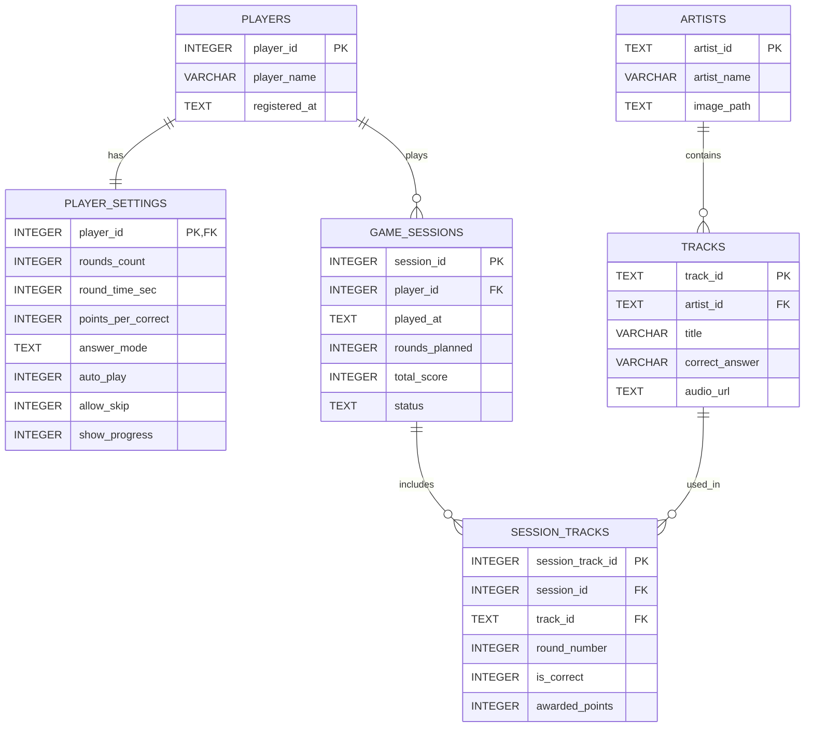

# Отчёт по заданию УП.11

## 1. Тема базы данных

База данных разработана для приложения **SoundQuiz**.  
Она хранит информацию об игроках, настройках игры, артистах, треках и сыгранных игровых сессиях.

## 2. Таблицы и поля

### `players`

Хранит список игроков.

| Поле | Тип | Назначение |
|---|---|---|
| `player_id` | `INTEGER` | Первичный ключ игрока |
| `player_name` | `VARCHAR(50)` | Имя игрока |
| `role` | `TEXT` | Роль игрока (`admin`/`user`) |
| `registered_at` | `TEXT` | Дата регистрации |

### `player_settings`

Хранит персональные настройки игрока.

| Поле | Тип | Назначение |
|---|---|---|
| `player_id` | `INTEGER` | PK и FK на `players.player_id` |
| `rounds_count` | `INTEGER` | Количество раундов |
| `round_time_sec` | `INTEGER` | Время на ответ |
| `points_per_correct` | `INTEGER` | Очки за правильный ответ |
| `answer_mode` | `TEXT` | Режим ответа (`flex`/`strict`) |
| `auto_play` | `INTEGER` | Автовоспроизведение |
| `allow_skip` | `INTEGER` | Разрешён пропуск |
| `show_progress` | `INTEGER` | Показывать прогресс |

### `artists`

Хранит исполнителей.

| Поле | Тип | Назначение |
|---|---|---|
| `artist_id` | `TEXT` | Первичный ключ артиста |
| `artist_name` | `VARCHAR(100)` | Имя артиста |
| `image_path` | `TEXT` | Путь к изображению |

### `tracks`

Хранит музыкальные треки.

| Поле | Тип | Назначение |
|---|---|---|
| `track_id` | `TEXT` | Первичный ключ трека |
| `artist_id` | `TEXT` | FK на `artists.artist_id` |
| `title` | `VARCHAR(200)` | Название трека |
| `correct_answer` | `VARCHAR(200)` | Правильный ответ |
| `audio_url` | `TEXT` | Ссылка на аудио |

### `game_sessions`

Хранит сыгранные партии.

| Поле | Тип | Назначение |
|---|---|---|
| `session_id` | `INTEGER` | Первичный ключ сессии |
| `player_id` | `INTEGER` | FK на `players.player_id` |
| `played_at` | `TEXT` | Дата и время игры |
| `rounds_planned` | `INTEGER` | Сколько раундов запланировано |
| `total_score` | `INTEGER` | Итоговый счёт |
| `status` | `TEXT` | Статус сессии |

### `session_tracks`

Связующая таблица между сессиями и треками.

| Поле | Тип | Назначение |
|---|---|---|
| `session_track_id` | `INTEGER` | Первичный ключ записи |
| `session_id` | `INTEGER` | FK на `game_sessions.session_id` |
| `track_id` | `TEXT` | FK на `tracks.track_id` |
| `round_number` | `INTEGER` | Номер раунда |
| `is_correct` | `INTEGER` | Правильный ли ответ |
| `awarded_points` | `INTEGER` | Начисленные очки |

## 3. Ключи и связи

- `players` -> `player_settings`: связь **1:1**
- `artists` -> `tracks`: связь **1:M**
- `players` -> `game_sessions`: связь **1:M**
- `game_sessions` <-> `tracks` через `session_tracks`: связь **M:N**

## 4. ER-диаграмма



## 5. Обязательные SQL-запросы

В файле [queries.sql](/Users/riad/Desktop/i/backend/database-assignment/queries.sql) подготовлены и выполнены:

1. `SELECT` с `WHERE`
2. `INSERT`
3. `UPDATE`
4. `DELETE`
5. `SELECT` с `JOIN`

## 6. Что сдавать

- Скрипт создания БД: [soundquiz_database.sql](/Users/riad/Desktop/i/backend/database-assignment/soundquiz_database.sql)
- Файл запросов: [queries.sql](/Users/riad/Desktop/i/backend/database-assignment/queries.sql)
- База SQLite: [soundquiz.db](/Users/riad/Desktop/i/backend/database-assignment/soundquiz.db)
- Отчёт: [report.md](/Users/riad/Desktop/i/backend/database-assignment/report.md)
- Структура таблиц для скриншота: [schema_output.txt](/Users/riad/Desktop/i/backend/database-assignment/schema_output.txt)
- Список таблиц для скриншота: [tables_output.txt](/Users/riad/Desktop/i/backend/database-assignment/tables_output.txt)
- Выполнение SQL-запросов для скриншота: [query_results.txt](/Users/riad/Desktop/i/backend/database-assignment/query_results.txt)

## 7. Команды для проверки

```bash
cd /Users/riad/Desktop/i/backend/database-assignment
sqlite3 soundquiz.db < soundquiz_database.sql
sqlite3 soundquiz.db ".tables"
sqlite3 soundquiz.db ".schema"
sqlite3 soundquiz.db < queries.sql
```

## 8. Что можно сфотографировать как скриншоты

- Открыть `schema_output.txt` и сделать скриншот структуры таблиц.
- Открыть `query_results.txt` и сделать скриншот выполнения SQL-запросов.
- При необходимости открыть `tables_output.txt`, чтобы показать состав БД.
